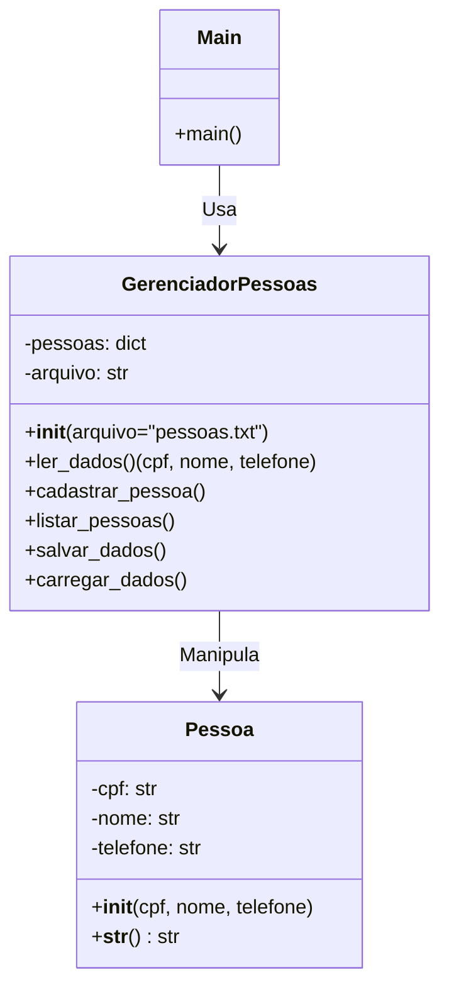

## **1. Introdução**  
### **O que é Programação Orientada a Objetos (POO)?**  
- Paradigma de programação que organiza o código em **objetos**, que são instâncias de **classes**.  
- Foca na abstração, encapsulamento, herança e polimorfismo.  
- Python suporta POO de forma flexível e intuitiva.  

### **Por que usar POO?**  
 **Reutilização de código** (herança, composição)  
 **Organização melhorada** (modularidade)  
 **Manutenção mais fácil** (encapsulamento)  
 **Modelagem do mundo real** (objetos representam entidades)  

---

## **2. Conceitos Fundamentais da POO**  

| **Conceito**       | **Definição** | **Exemplo em Python** |
|---------------------|--------------|-----------------------|
| **Classe**          | Molde que define atributos e métodos de um objeto. | `class Pessoa:` |
| **Objeto**          | Instância de uma classe. | `pessoa1 = Pessoa()` |
| **Atributo**        | Variáveis que armazenam dados do objeto. | `self.nome = "João"` |
| **Método**          | Funções associadas a um objeto. | `def falar(self):` |
| **Encapsulamento**  | Proteção de dados (privados/públicos). | `self.__salario` (privado) |
| **Herança**         | Uma classe herda atributos e métodos de outra. | `class Aluno(Pessoa):` |
| **Polimorfismo**    | Mesma função comportando-se diferente em classes diferentes. | `def calcular_area()` em `Circulo` e `Quadrado` |

---

## **3. Sintaxe Básica em Python**  

### **Definindo uma Classe**  
```python
class Pessoa:
    def __init__(self, nome, idade):  # Construtor
        self.nome = nome  # Atributo público
        self.__idade = idade  # Atributo privado (__)

    def apresentar(self):  # Método
        print(f"Olá, meu nome é {self.nome}!")
```

### **Criando um Objeto**  
```python
pessoa1 = Pessoa("Maria", 25)
pessoa1.apresentar()  # Saída: "Olá, meu nome é Maria!"
```

### **Herança**  
```python
class Aluno(Pessoa):  # Herda de Pessoa
    def __init__(self, nome, idade, matricula):
        super().__init__(nome, idade)  # Chama construtor da classe pai
        self.matricula = matricula

    def apresentar_aluno(self):
        super().apresentar()  # Chama o método apresentar da classe pai
        print(f"Minha matrícula é: {self.matricula}")
```

Usando a classe Aluno:

```python
# Criando um objeto da classe Aluno
aluno1 = Aluno("Carlos Silva", 20, "20231015")

# Acessando os atributos do objeto aluno1
print(f"Nome do aluno: {aluno1.nome}")
print(f"Idade do aluno: {aluno1.idade}")
print(f"Matrícula do aluno: {aluno1.matricula}")

# Chamando os métodos do objeto aluno1
aluno1.apresentar()       # Método herdado da classe Pessoa
aluno1.apresentar_aluno() # Método específico da classe Aluno
```

---

## **4. Caso de Uso: Sistema de Gerenciamento de Pessoas**  

### **Problema:**  

Desenvolver um sistema para cadastrar, listar e salvar pessoas em um arquivo.  

A aplicação principal (main) interage com uma classe "Gerenciador de Pessoas" que manipula a classe Pessoa



### **Solução com POO:**  
```python
class Pessoa:
    def __init__(self, cpf, nome, telefone):
        self.cpf = cpf
        self.nome = nome
        self.telefone = telefone

    def __str__(self):
        return f"CPF: {self.cpf}, Nome: {self.nome}, Telefone: {self.telefone}"

class GerenciadorPessoas:
    def __init__(self, arquivo="pessoas.txt"):
        self.pessoas = {}
        self.arquivo = arquivo
        self.carregar_dados()

    def ler_dados(self):
        cpf = input("Digite o CPF: ")
        nome = input("Digite o nome: ")
        telefone = input("Digite o telefone: ")
        return cpf, nome, telefone

    def cadastrar_pessoa(self):
        cpf, nome, telefone = self.ler_dados()
        pessoa = Pessoa(cpf, nome, telefone)
        self.pessoas[cpf] = pessoa
        print("Pessoa cadastrada com sucesso!")

    def listar_pessoas(self):
        if not self.pessoas:
            print("Nenhuma pessoa cadastrada.")
            return
        for pessoa in self.pessoas.values():
            print(pessoa)

    def salvar_dados(self):
        try:
            with open(self.arquivo, "w") as arquivo:
                for pessoa in self.pessoas.values():
                    linha = f"{pessoa.cpf},{pessoa.nome},{pessoa.telefone}\n"
                    arquivo.write(linha)
            print(f"Dados salvos em '{self.arquivo}'!")
        except IOError:
            print(f"Erro ao salvar dados no arquivo '{self.arquivo}'.")

    def carregar_dados(self):
        try:
            with open(self.arquivo, "r") as arquivo:
                for linha in arquivo:
                    cpf, nome, telefone = linha.strip().split(",")
                    pessoa = Pessoa(cpf, nome, telefone)
                    self.pessoas[cpf] = pessoa
            print("Dados carregados com sucesso!")
        except FileNotFoundError:
            print(f"Arquivo '{self.arquivo}' não encontrado. Criando um novo...")
        except IOError:
            print(f"Erro ao ler dados do arquivo '{self.arquivo}'.")

def main():
    gerenciador = GerenciadorPessoas()
    while True:
        print("\n--- MENU ---")
        print("1. Cadastrar pessoa")
        print("2. Listar pessoas")
        print("3. Salvar dados")
        print("4. Sair")
        opcao = input("Escolha uma opção: ")

        if opcao == "1":
            gerenciador.cadastrar_pessoa()
        elif opcao == "2":
            gerenciador.listar_pessoas()
        elif opcao == "3":
            gerenciador.salvar_dados()
        elif opcao == "4":
            print("Saindo...")
            break
        else:
            print("Opção inválida!")

if __name__ == "__main__":
    main()
```

---

## **5. Boas Práticas em POO com Python**  

 **Use nomes claros** para classes (`Pessoa`, `ContaBancaria`).  
 **Encapsule atributos** quando necessário (`self.__saldo`).  
 **Documente classes e métodos** com docstrings (`"""Classe que representa..."""`).  
 **Evite herança múltipla** (priorize composição).  
 **Mantenha métodos pequenos e especializados** (SOLID).  

---

## **6. Benefícios da POO**  

 **Código mais organizado e modular**  
 **Facilita manutenção e escalabilidade**  
 **Promove reutilização (herança, composição)**  
 **Melhor modelagem de problemas do mundo real**  
